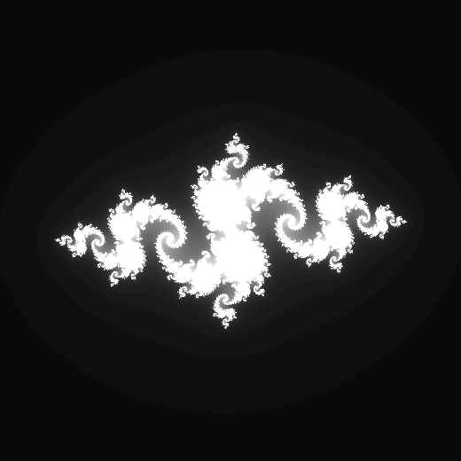
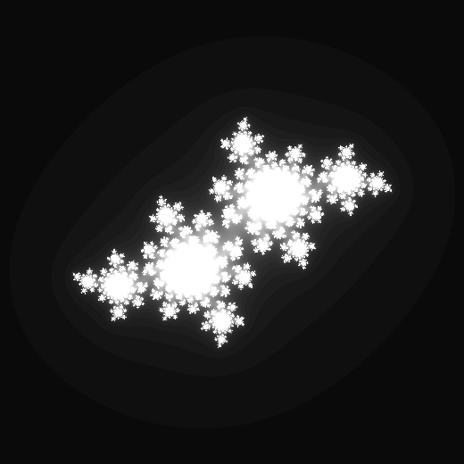
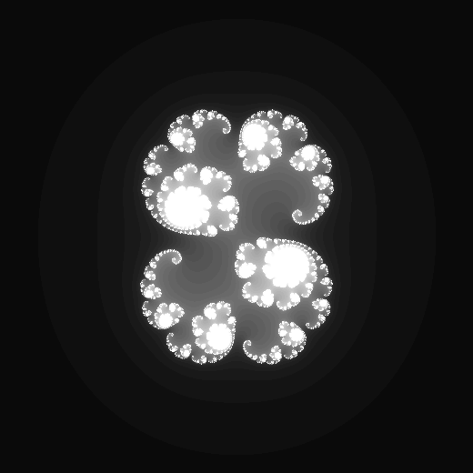

# Julia Set Pattern Generator

    

## Julia Sets

> [!INFO]
>
> A **Julia set**, named after the French mathematicians Gaston Julia and Pierre Fatou, is a concept in the field of complex dynamics, a branch of mathematics.
>
> The Julia set and the Fatou set are two complementary sets defined from a function. The Fatou set of the function consists of values with the property that all nearby values behave similarly under repeated iteration of the function, and the Julia set consists of values such that an arbitrarily small perturbation can cause drastic changes in the sequence of iterated function values. Thus, the behavior of the function on the Fatou set is “regular”, while on the Julia set its behavior is "chaotic".
>
> The “filled-in” Julia set is the set of points which do not approach infinity after a function is repeatedly applied. This corresponds to a strange attractor.
>
>Julia sets are known for their intricate and beautiful fractal patterns. They exhibit an infinite amount of fine detail: you can zoom in on the edge of the fractal forever, and it will continue to reveal ever-smaller details.

    
    
    

## Generator

This Python program lets the user create a custom Julia Set fractal, or a video from a custom vector. The program creates visual representations of a chosen fractal, chosed by the user.

Some user options are:
 - Julia's Constant (Point that defines Fractal)
 - Image Size
 - File Name
 - Media Format

Currently Available Formats:

   - Video
     - MP4
     - GIF
   - Image
     - PNG
     - PGM

